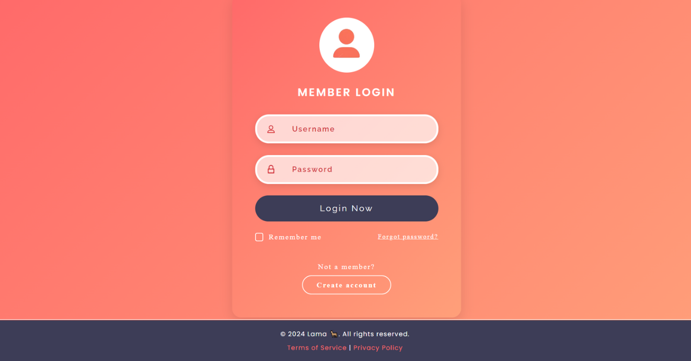

   
  <h1>Login Page - README </h1>
  ## Overview
  <strong>This is a responsive login page built using HTML and CSS. The page features a member login form, complete with "Remember me" functionality, and links for account creation and password recovery. It also includes responsiveness, ensuring a seamless experience across different screen sizes.</strong> &nbsp; 

 
 
 

<strong>The required login page:</strong> &nbsp; 

  

 
 
<strong>The final result:</strong> &nbsp; 

  

 
 

